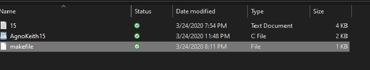

 
 
 
 
 
 
 
 
 
 
 

I made this program in my ICS 212 class and will translate a International Morse Code in English through command line input. This was my first time learning C language and I used it to make this program.

I made an array of Morse Code called morse[]. Each elements corresponds to each Morse Code and its letter and number.
 
 
 
 
 
 
 
 
 
 
 
 
 
And then the nested for loop will check if the user's argument input is the same with the morse[] array. Will return the letters instead of the Morse Code when it passes.
 
 
 
 
