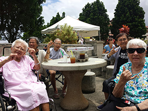

 My mother used to work for Kina 'Ole and I was invited to join them. I was excited to be able to help the senior citizens and let them get a taste of the beautiful sceneries around the island. We ended the day by watching the Polynesian Cultural Center Night Show.
 The elders were happy that day. Being young that time, I felt the hardwork my mother and other employees do working that job. I have learned many experiences through this volunteer event.

Source: https://www.kinaoleestate.com/

