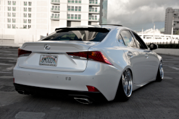
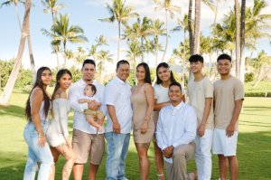

  
  

  As the corona virus hit America in the beginning of 2020, I started a hobby that could keep me busy.  With the entry level dslr camera, Nikon d3400, I was skeptical about producing high quality pictures. As I get more into photograhpy, I bought a new entry level(still cheap) mirrorless camera Nikon z50. Both cameras are cropped sensor. Thus, making it cheaper than full frame cameras.
  
  

  
  

  

  Many freelance photographers have high-end cameras and lenses. I thought I would never to produce the same photos as them. However, as I kept shooting with my camera, I learned that it is not about the equipment. It is about the photographer and how they use their skills. As this project focuses on low-budget style, I used GIMP, which is a free application. This gave me the power to edit my photos. I created a website that showcases my work as a freelance photographer. The website shows evidence that I can compete in the same field with the current equipment I use. I am still working on this project and will keep updating it.
  

You can learn more at: [Budgetphotography](https://kpmigee.wixsite.com/budgetphotography/)
